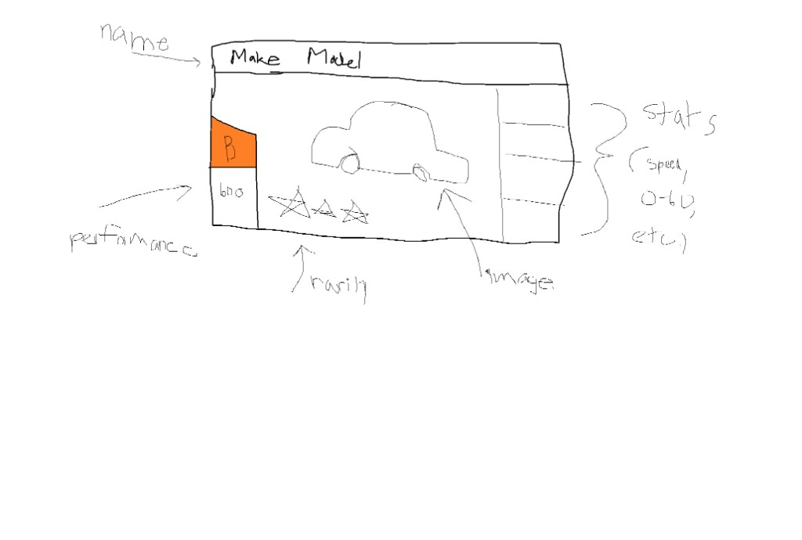

# Card layout reference (non-final)

Hand-drawn sketch showing how modular card **components** assemble: name header, base car image, optional performance block (class + rating), rarity stars, and traditional stats column.

This is **not** final art — implementation uses `src/renderers/card/components/` with per-component toggles. See the **Phase 3 — Modular Card Composition** plan in the project implementation plans.

